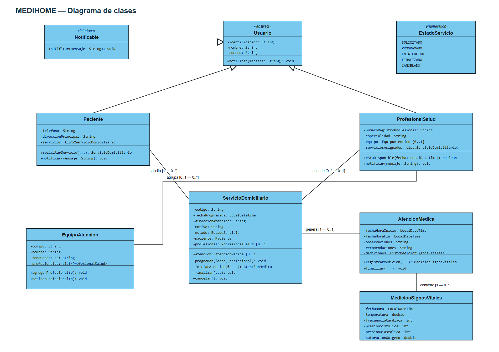

# MEDIHOME — Atención médica domiciliaria

Proyecto académico que modela la administración de servicios de atención médica domiciliaria de MEDIHOME. Incluye el diagrama de clases, su fuente editable y una implementación en Java con un escenario demostrativo completo.

## Participantes

- **Participante 1:** Santiago Tulcan
- **Participante 2:** Pendiente de confirmar

## Contenido

- `diagramas/diagrama-clases-medihome.png`: imagen final del diagrama de clases.
- `diagramas/diagrama-clases-medihome.svg`: fuente vectorial editable del diagrama construido en Visual Paradigm Online.
- `diagramas/diagrama-clases-medihome.puml`: fuente textual de respaldo del mismo modelo UML.
- `src/main/java/co/edu/medihome/`: clases Java del dominio y clase `Main`.

## Diagrama de clases



## Modelo implementado

- `Usuario` es la superclase abstracta de `Paciente` y `ProfesionalSalud`.
- `Notificable` define el contrato para recibir notificaciones.
- Un paciente solicita varios servicios; cada servicio pertenece a un único paciente.
- Un servicio puede tener un profesional asignado y generar como máximo una atención médica.
- La atención y sus mediciones de signos vitales usan composición: no existen independientemente de sus contenedores.
- Un equipo agrega profesionales; cada profesional pertenece como máximo a un equipo a la vez.
- `EstadoServicio` limita los estados a solicitado, programado, en atención, finalizado y cancelado.

## Requisitos

- JDK 17 o posterior.

## Compilar y ejecutar

Desde la raíz del repositorio, en PowerShell:

```powershell
New-Item -ItemType Directory -Force out | Out-Null
javac -encoding UTF-8 -d out (Get-ChildItem -Recurse src/main/java -Filter *.java).FullName
java -cp out co.edu.medihome.Main
```

La ejecución crea un paciente, un profesional, un equipo, un servicio domiciliario, una atención médica y una medición de signos vitales. Finalmente imprime el reporte de la atención prestada.

